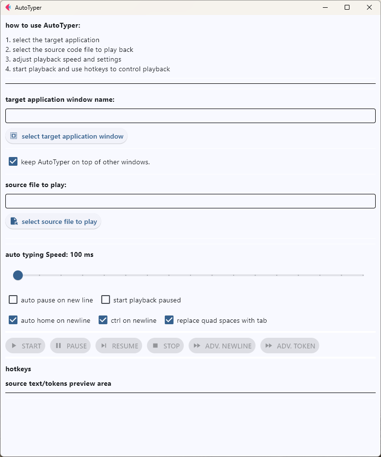

# auto-typer
A utility for auto typing a source file in a controlled way.
Intended use is for helping those trying to teach coding  via recorded video.

<<YT Video here soon>>

### Note:
When using vscode, the auto formatting and auto closure features can cause some issues.
There is a settings file `vscode_settings.json` which can be used to remove these for a session.
You will need to move to the projects .vscode folder, and rename to settings.json, or add the
contents to the projects current settings.json if it is already there.

# Python Version
Tested with 3.12.9
